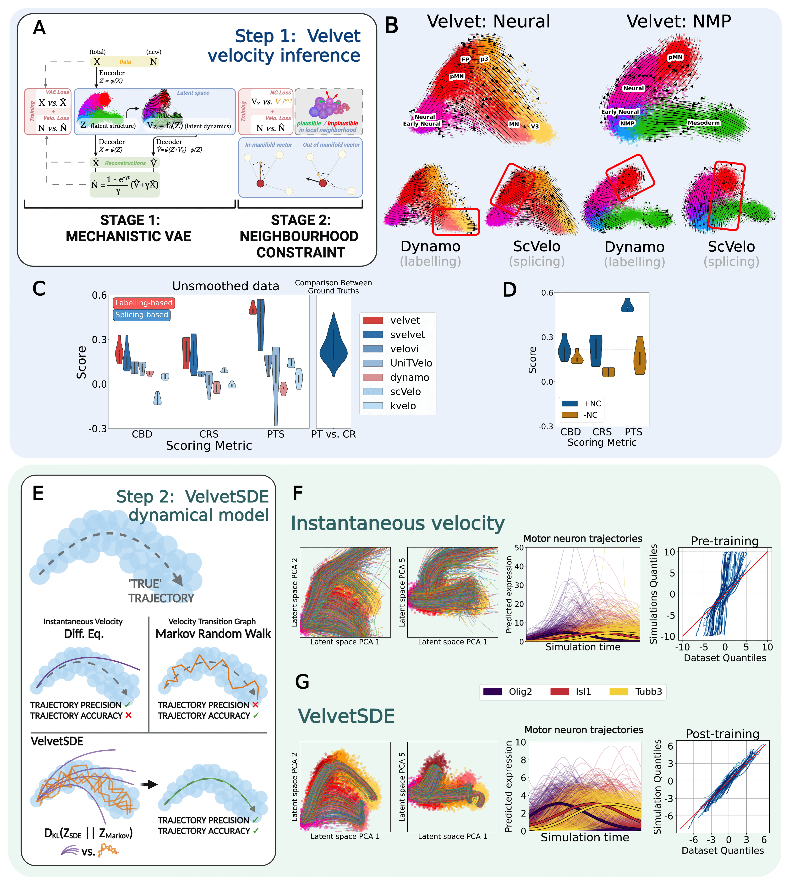

<p align="center">
  
</p>

## **VelvetVAE**: deep dynamical modelling from temporal transcriptomics.

Analysis software for modelling dynamics of developing systems as neural stochastic differential equation (nSDE) systems using deep generative modelling and time-resolved scRNA-seq data (such as metabolic labelling).

For more details see the pre-print: [Maizels et al, 2023](https://www.biorxiv.org/content/10.1101/2023.07.06.547989v1).

This package is under active development: it will soon be available on pip with documentation and tutorials.



## Installation

Currently, velvetVAE + velvetSDE can be installed as follows:
```
pip install git+https://github.com/rorymaizels/velvetVAE --user
```

## Usage

Until tutorials and documentation are completed, demonstration of how to use velvet can be found in the code reproducing the analysis from [Maizels et al, 2023](https://www.biorxiv.org/content/10.1101/2023.07.06.547989v1), available [here](https://github.com/rorymaizels/Maizels2023aa). In particular, useful notebooks may include:
- [Basic visualisation of velocity dynamics using velvet](https://github.com/rorymaizels/Maizels2023aa/blob/main/analysis/A2.0.0_velvet_demo.ipynb)
- [Benchmarking code with standard pipeline for velvet](https://github.com/rorymaizels/Maizels2023aa/tree/main/analysis/A2.2_benchmarking)
- [Benchmarking code with standard pipeline for svelvet (with splicing data)](https://github.com/rorymaizels/Maizels2023aa/blob/main/analysis/A2.2_benchmarking/B02_svelvet_benchmarking.py)
- [Benchmarking code with standard pipeline for velvetSDE](https://github.com/rorymaizels/Maizels2023aa/blob/main/analysis/A2.2_benchmarking/B20_velvetSDE_benchmarking.py)
- [Downstream analysis looking at cell fates](https://github.com/rorymaizels/Maizels2023aa/blob/main/analysis/A3.0_NMP_cellfate.ipynb)

For details on raw data processing for sci-FATE/sci-FATE2 using dynast, see:
https://github.com/rorymaizels/sciFATE2_processing

For any questions, either raise an issue or email rory.maizels@crick.ac.uk.
